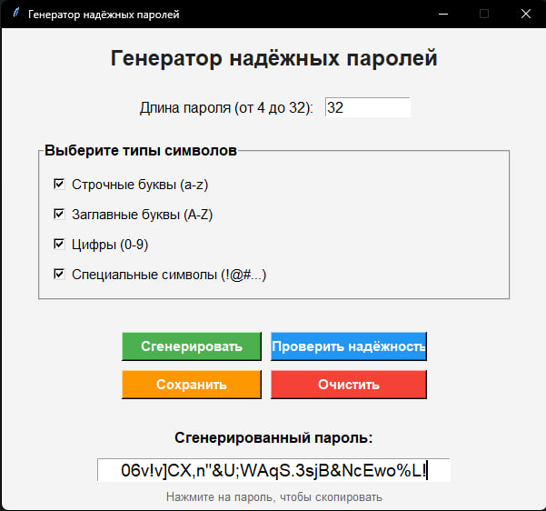
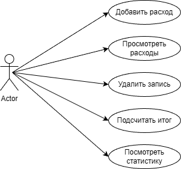
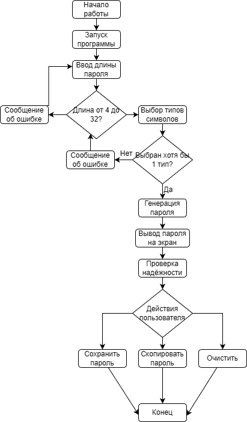

# password-generator
Программа для генерации и проверки надёжных паролей с графическим интерфейсом на Python (Tkinter)
# 🔐 Генератор надёжных паролей

## 📌 Описание проекта
Данный проект представляет собой программу на Python с графическим интерфейсом (Tkinter), предназначенную для генерации и проверки надёжных паролей.

Пользователь может задать параметры пароля (длина, тип символов), сгенерировать пароль, оценить его надёжность и сохранить результат в файл.

---

## 🎯 Цель проекта
Создание удобного инструмента для генерации сложных и безопасных паролей с возможностью проверки их надёжности.

---

## ⚙️ Функционал программы
- Генерация пароля заданной длины
- Выбор типов символов:
  - строчные буквы
  - заглавные буквы
  - цифры
  - специальные символы
- Проверка корректности ввода данных
- Оценка надёжности пароля
- Сохранение пароля в файл
- Логирование действий в отдельный файл
- Графический интерфейс (GUI)
- Наличие нескольких окон

---

## 🖥️ Интерфейс программы

---

## 🧠 Use Case

---

## 🔄 Блок-схема работы программы

---

